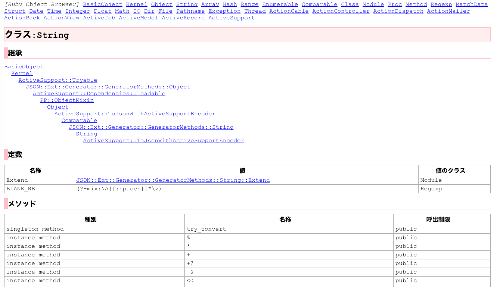
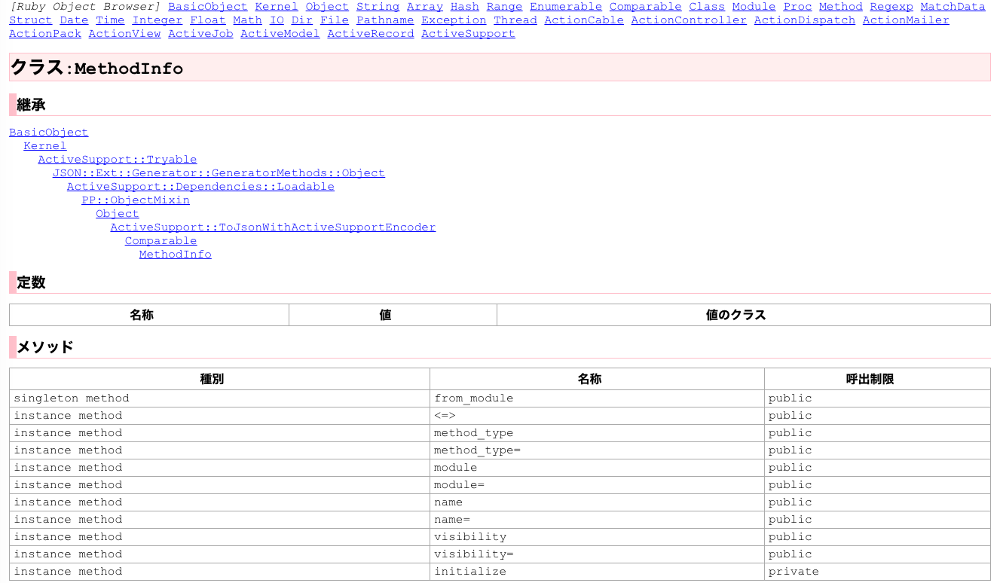
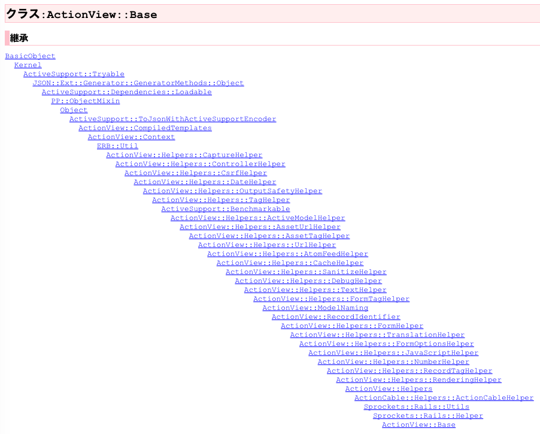
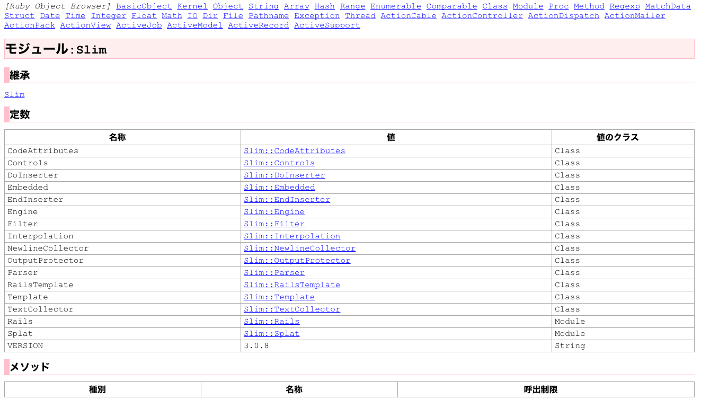

# Ruby オブジェクトブラウザ

Rubyのモジュール(クラス)の情報を観察するためのWebアプリ。
指定した任意のモジュールについて、継承関係、含まれる定数・メソッドの情報を表示することができます。
ページ上のモジュール名部分をクリックすると、そのモジュールの表示へと移動することができます。

Ruby on Rails環境上であるため、表示される情報にはRails関連のものも含まれます。

実際に動作しているプロセスから読み込んだ生の(?)情報が表示されますので、
各種マニュアルからは得られないような発見があるかもしれません。

## Stringクラスの情報を表示した場合

画面上部には、よく使うと思われるモジュールへのリンクがあります。

## 自作のクラスの情報を表示した場合

このアプリ内で使用している`MethodInfo`クラスを表示しています。

## Railsの`ActionView::Base`を表示した場合

たくさんのモジュールがインポートされているのが確認できます。

## Railsアプリで使用しているGemのモジュール情報を表示した場合

Slimテンプレートエンジンの`Slim`モジュールを表示。

